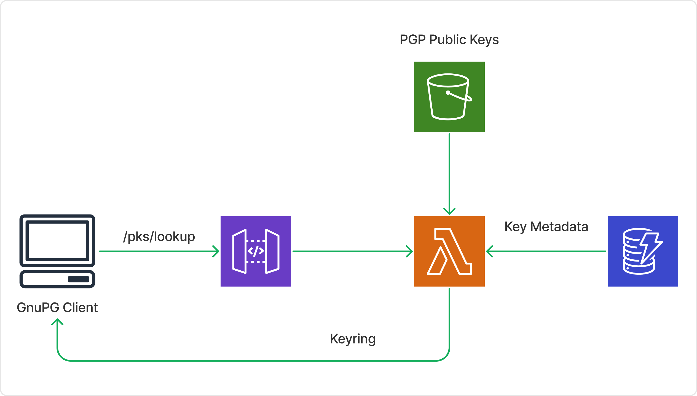

# pgp-serverless-js
PGP Server(less) is a proof-of-concept "serverless" PGP Keyserver designed to be deployed as an AWS Lambda function. It
supports searching and retrieving PGP public keys over the `HKP` protocol.

An example deployment is reachable at [`hkps://keys.uselessmnemonic.com`](https://keys.uselessmnemonic.com/pks/lookup?op=index&search=chris)

### Notes on the Source
You will notice a heavy use of the result pattern, because I despise exceptions in JavaScript. `Result`, `AsyncResult`,
and `AsyncResultGenerator` are designed to capture exceptions and propagate them in a controlled manner.

## Architecture
This implementation takes advantage of DynamoDB to store records for each key, and S3 as a storage mechanism for actual
key data.

### DynamoDB Table
The PGP table is organized by the following primary key:
```
+===============+=====================+
| Partition Key |      Sort Key       |
+===============+=====================+
| pgpKeyId      | pgpFingerprintUpper |
+---------------+---------------------+
```

Here, `pgpKeyId` represents a key's 16-digit hex ID. `pgpFingerprintUpper` represents the upper portion of the key's
fingerprint such that the fingerprint is `${pgpFingerprintUpper}${pgpKeyId}`. As a consequence, this implementation is
not prepared to handle V3 keys.

Arbitrary attributes can be attached to each entry of the table, but one in particular is expected for all entries:
```
+===============+========+============================+
|   Attribute   |  Type  |          Example           |
+===============+========+============================+
| primaryUserId | string | Jane Doe <jdoe@domain.com> |
+---------------+--------+----------------------------+
```

With this schema, queries for keys by fingerprints can be completed with `GetItem` operations, while queries performed
on 16-digit Key IDs complete quickly with `Query` operations. As a trade-off, queries on User IDs must be completed with
`Scan` operations. A private keyserver using this implementation would presumably not need to worry about scanning
several gigabytes of data, but who would be opposed to solving that sort of issue? :-)

### S3 Bucket
Key data is not included in the table, because each key is many times larger than its corresponding entry in the table,
and its inclusion would be wasteful. Instead, public keys are expected to be stored on S3. When key data is requested,
it will be transferred from S3 through the Lambda Function to the client.

Each key is named by its fingerprint, and is retrieved with `GetObject`.

### API Gateway
This implementation expect the `/pks/lookup` route will be available through API Gateway, or at least that requests will
be formatted correctly. Responses are Gateway results to allow for straight-forward integrations with API Gateway.



## Future Goals
- Add support for adding and removing keys
- Add support for authenticated operations
- Issue redirects to S3, either to a bucket URL or another domain, when a single key is requested
